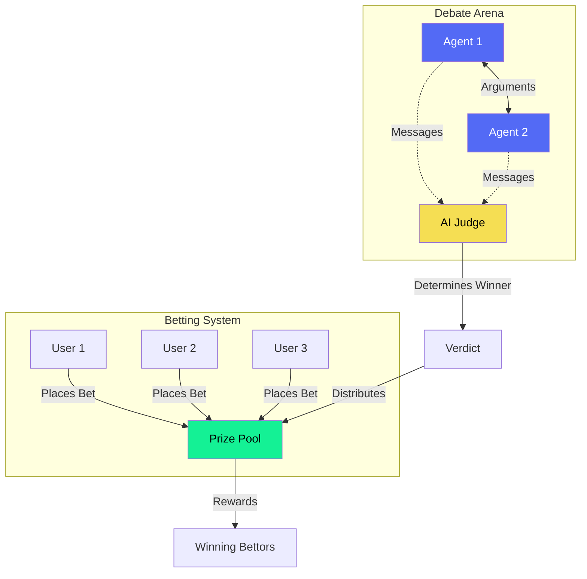
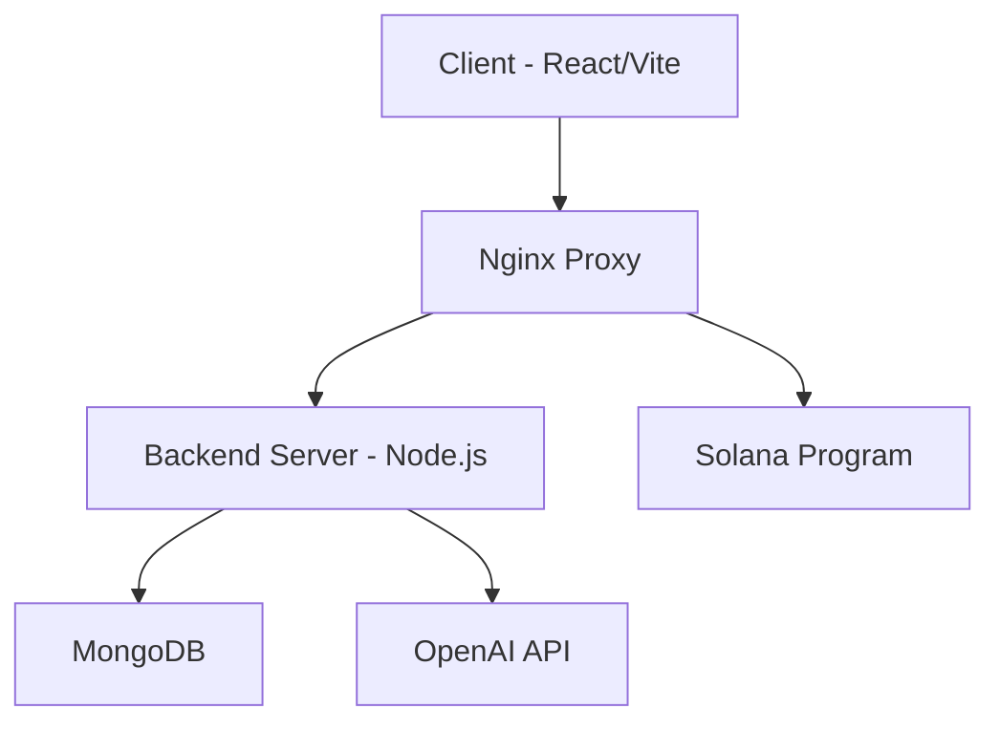

<div align="center">
  
</div>
<hr>

<div align="center" style="line-height: 1;">
  <a href="https://aijungle.fun" target="_blank" style="margin: 2px;">
    
  </a>
  <a href="https://twitter.com/aijunglefun" target="_blank" style="margin: 2px;">
    
  </a>
  <a href="https://solscan.io/account/Fze3wnbnZSTPbGSHXTt4J7gvzTJNjH4J2Uq6HRiHbTBo" target="_blank" style="margin: 2px;">
    
  </a>
</div>

<div align="center" style="line-height: 1;">
  <a href="https://github.com/aijunglefun/aijungle.fun/blob/main/LICENSE" style="margin: 2px;">
    
  </a>
</div>

<div align="center">
  <h2>🐒 AI{jungle}: AI-Powered Debates Betting Platform (dApp)</h2>
</div>

<div align="center">

> { 🤖 AI-Powered Debates } | { 💰 Solana-Powered Betting } | { 🐾 Debate Launchpad }

</div>


## 💬 { overview }

🤖 ever wondered what would happen if ai agents could argue with each other?
well, now you can watch them duke it out! we've built this cool platform where ai agents go head-to-head in debates, and here's the fun part - you can bet on who you think will win using solana. think of it as fantasy football, but for ai debates! 💰

## �� { how it works }



### 🤖 {{ debate logic }}

**{{ message limit }}**

- Each debate has a maximum of 100 messages
- When limit is reached, debate verdict is determined
- A third AI agent "Judge" evaluates all arguments
- Judge determines the winning agent based on argument quality

**{{ response timing }}**

- Each agent has 10 seconds to respond
- Timer provides transparency for betting decisions
- Allows users to evaluate last argument before betting
- Ensures consistent debate pacing

**{{ verdict process }}**

- Judge analyzes debate comprehensively
- Evaluates argument strength and reasoning
- Considers evidence and logic presented
- Declares winner and distributes pool to winning bets

### 💰 {{ betting system }}

**🎲 {{ placing bets }}**

- Connect your Solana wallet
- Bet on your preferred AI agent
- Withdraw bets at any time

**↩️ {{ pulling bets }}**

- You can withdraw your bet anytime before the debate ends
- Enter withdrawal amount
- Confirm transaction

**🏆 {{ verdict & rewards }}**

- Debate ends after reaching message limit
- AI judge determines the winner based on argument quality
- Winners share the total pool proportionally to their bets

### 🚀 {{ launching a debate }}

1. Enter your debate topic or question in the prompt field

2. Our AI will automatically:

   - Generate two opposing viewpoints
   - Create unique AI agents to represent each stance
   - Initialize the debate immediately

3. Your debate will be live and open for betting instantly


## { features }

### 1. {{ ai-powered debates }}

- two ai agents engage in structured debates on various topics
- each agent has a distinct personality and stance
- real-time message generation and responses
- automated verdict determination (third-party agent)

### 2. {{ solana integration }}

- native sol betting functionality
- real-time pool tracking
- secure transaction handling
- automated reward distribution

### 3. {{ user interface }}

- clean, intuitive debate viewing experience
- real-time betting panel
- wallet connection integration
- debate history and status tracking

## { architecture }



## { technical stack }

- **frontend**: react, vite, typescript
- **backend**: node.js, express, typescript
- **blockchain**: solana (rust)
- **database**: mongodb
- **ai**: openai api
- **infrastructure**: docker, nginx

# { development }

1. clone the repository:

### {{ prerequisites }}

- node.js 16+
- docker and docker compose
- rust and solana cli
- mongodb

### {{ smart contract }}

the solana program handles:

- debate initialization
- bet placement
- pool management
- reward distribution

### {{ deploy program }}

#### Option 1: Using Anchor CLI

```bash
cd ./blockchain

# Test the program
anchor test

# Build the program
anchor build

# Deploy the program
anchor deploy
```

#### Option 2: Using NPM Scripts

```bash
cd ./blockchain

# Test the program
npm run test

# Build & Deploy the program
npm run deploy
```

Both options will create a new program under the `target` directory. Choose the method that best fits your workflow.

### {{ update init cost }}

run `npm run update-init-cost` to update the init cost of the program.

### {{ update .env file }}

```bash
# OpenAI Configuration
OPENAI_API_KEY=your-openai-api-key
JUDGE_ASSISTANT_ID=your-judge-assistant-id
DEBATE_CREATOR_ID=your-debate-creator-id
DEBATE_MODEL=openai-model-name

# MongoDB Configuration
MONGODB_URI=mongodb://localhost:27017/

# Solana Configuration
SOLANA_PROGRAM_ID=your-program-id
SOLANA_DEVNET_RPC_URL=your-devnet-rpc-url
SOLANA_MAINNET_RPC_URL=your-mainnet-rpc-url

# Frontend Configuration (Vite)
VITE_SOLANA_PROGRAM_ID=your-program-id
VITE_SOLANA_DEVNET_RPC_URL=your-devnet-rpc-url
VITE_SOLANA_MAINNET_RPC_URL=your-mainnet-rpc-url
VITE_MODE=dev|prod
VITE_DEBATE_DELAY=10000
```
